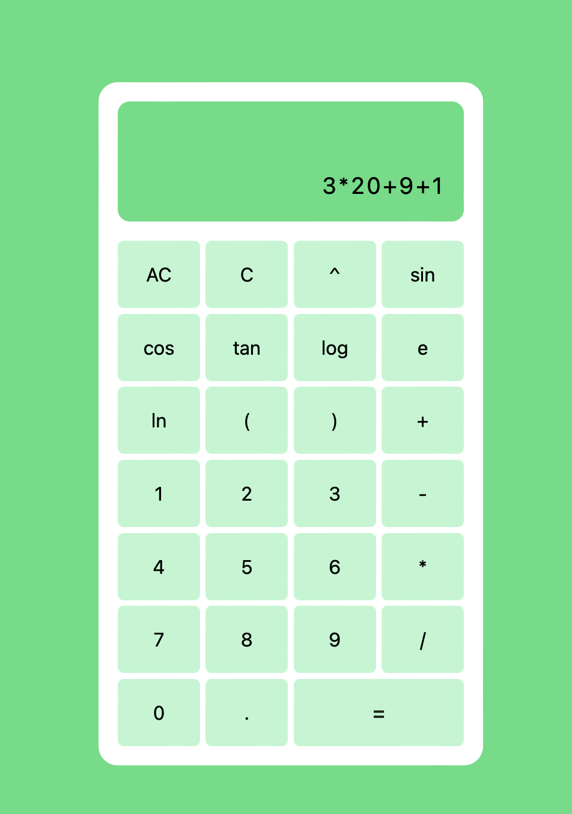

This is a calculator using Chatgpt for my CS4800 class

Requirements for this Paper

- Build a calculator that can Add, Subtract, Multiply & Divide numbers, Evaluate expressions with Power, Trigonometry, Log and Exponent functions
- The calculator needs to have a user interface. You can choose any programming language.
- Its recommended that Calculator uses Prompt Engineering and OpenAI's API for ChatGPT to evaluate user expressions.
- Provide a rough estimate of how many hours you think this will take
- Log time spent on the project
- Date & Hours worked each day
- Categorize your time between
  - Requirements Analysis & Design
  - Development
  - Testing
- Record number of bugs/defects found during testing
- Compare your total time spent with your initial estimate
- Submission should include the following
  - Source Code for the Calculator
  - Screenshots of the Output
  - Write-up with Estimated versus Actual Hours spent on the assignment.

Day 1:
I will try my best to document how this journey goes. I guess first off is providing an estimate of how many hours I think this project will take. I think I'll take roughly 30 hours to finish this project. Some experience I is creating a calculator with javascript and using api calls. I do not have much experience with openAI's api and how to use it.
Time spent today roughly around 2 hours. I have implemented a calculator but haven't made any calls to the api yet.

Day 2:
Added Trig and log functions.
30 minutes

Day 3: Trying to implement the openAI api but to no avail. 30 minutes

Day 4: Trying to implement geminiai, but still can't call it because of one issue that I'm having. I have my api-key in an env file so that it is not open to public to see. However, I am unable to call the apikey in this env. Not sure why. Spent 1 hour trying to get through this.

Day 5-7: Completed the ai call when pressing buttons, but it isn't displaying the result in the display once updated. Spent too long that I lost the track time. Lets say it was around 3 hours total.
